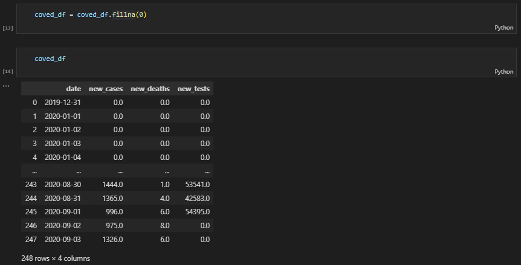
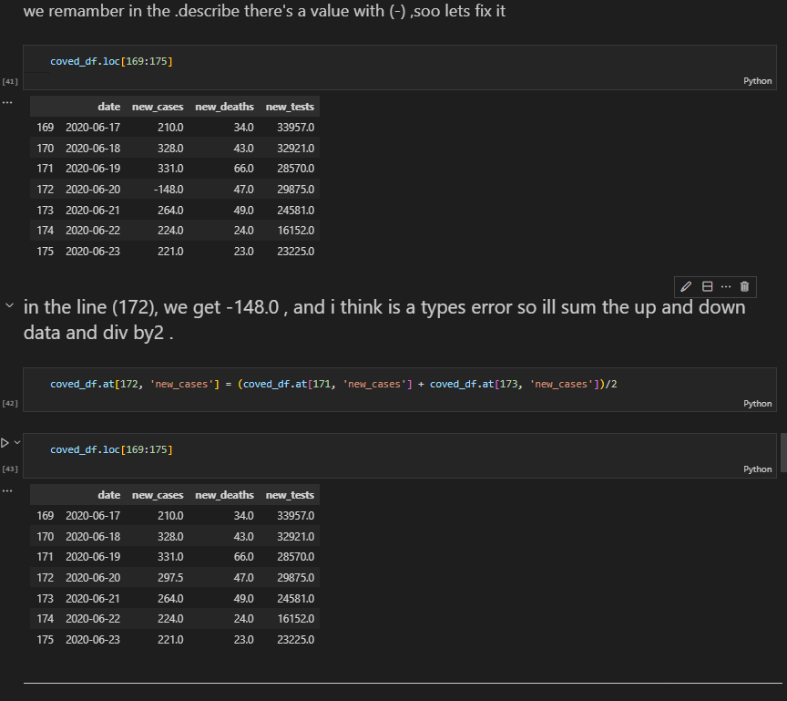
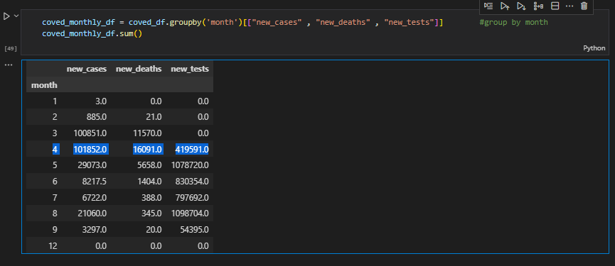
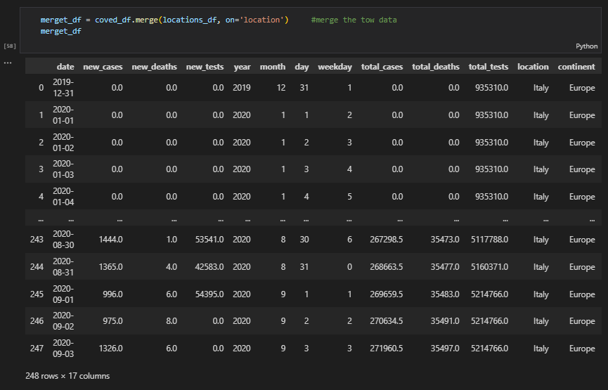

# 3 - italy_covid_Analysis-2020/2019
--------------------

--------------------
## Introduction

This project is on Italy's covid analysis, The project is to analyze and answer crucial questions.

## Problem Statement

- The highest new_deaths of the date between 2019/12/31 to 2020/9/3?
- What is the highest new_deaths and in which month?
And more …

### TOOLS
- PYTHON
- MICROSOFT EXCEL

## Data Sourcing

The datasets 
[main data](https://gist.githubusercontent.com/aakashns/f6a004fa20c84fec53262f9a8bfee775/raw/f309558b1cf5103424cef58e2ecb8704dcd4d74c/italy-covid-daywise.csv), (the main dataset).
[location](https://gist.githubusercontent.com/aakashns/8684589ef4f266116cdce023377fc9c8/raw/99ce3826b2a9d1e6d0bde7e9e559fc8b6e9ac88b/locations.csv), (the location dataset).
The dataset contains 248 rows and 4 columns.

### About the data : 

 - date : the date of the record	
 - new_cases : the number of new cases
 - new_deaths	: the number of new deaths
 - new_tests : the number of new tests

## Cleaning & Analysis

1- Using the (fillna(0)) function to replace the null/na values between 2020-04-09 TO 2020-04-20 (the bigender of the records), the nan stop at 2020/4/19, so there's two chances for the null values: 
  •	The data wasn't added 
  •	There are no new_teasts on those days 
So I used fillna(0)

-------------------------

2 – when I use a (describe) function there's a value with (-), so let's fix it, In line (172), we get -148.0, and I think is a types error so ill sum the up and down data and div by 2.

-------------------------

3 - Change the datatype of (data) from Object to dateTime and extract the (days, weekdays, months, years)

-------------------------

4 - Add the locations to the data 

-------------------------

5 - merge the two Data Frame

-------------------------

### We could discover the following things in the dataset:

1 - The highest new_deaths of the date between 2019/12/31 to 2020/9/3?

------------------
2 - The highest new_cases of the date between 2019/12/31 to 2020/9/3
    -	95273.0
3 - The number report of cases is 271515 and the number of death reported is 35497
4 - the overall death rate in itly is 13.00 %
5 - 5.21% of test is positive
6 - What is the highest new_deaths and in which month?

-----------------------------
7 – and more …

# Thank you

